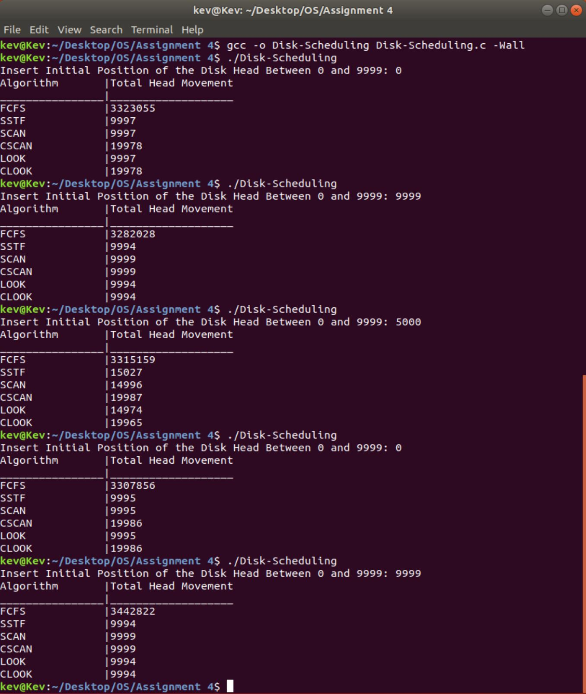

## Disk-Scheduling
Project for CSC 332 - Operating Systems with Professor Zaid Al-Mashhadni at the City College of New York.
## About The Project
- Write a program that implements the following disk-scheduling algorithms:
  1. FCFS
  2. SSTF
  3. SCAN
  4. C-SCAN
  5. LOOK
- Your program will service a disk with 10,000 cylinders numbered 0 to 9,999. The program will generate a random series of 1,000 cylinders requests and service them according to each of the algorithms listed above. The program will be passed the initial position of the disk head (as a parameter on the command line), and report the total amount of head movement required by each algorithm. Your program should show the result in a table.
## Additional Information
- There are comments in the code that illustrates the thought process and exactly what each line of code is doing.
- I added an extra disk-scheduling algorithm, CLOOK.
- I've tested that everything works using a small value then going higher and higher. I printed out each random number and head that it iterated through and did the math to see if it matched for each function. [DiskScheduling.JPG](images/DiskScheduling.JPG) is what was printed when running the program. During each time it ran, the output vary based on what has randomly generated and the starting head value
## Using the Application
### Disk Scheduling

## Ask me about anything
If there are any questions, feel free to ask them [here](https://github.com/ChibiKev/Disk-Scheduling/issues).